[TOC]


# Java Web 服务器实验报告

## 3180102943 常博宇

### 实验任务描述

```
以Socket建立一Web服务器，对不同文件扩展名采用不同方式向客户端传送内容：

1、.htm/.txt/.java文件：原样文本传送。

2、.zup：原样文本传送，但对"<%"和"%>"标记之间的内容按表达式或JS程序方式执行后传送结果。(静态网页)

3、.jzup：在第一次访问时将文件转化成"<文件名>_jzup.java"，手工或自动编译成相应的类，传送该类的执行结果。以后则直接传送"<文件名>_jzup.class"的运行结果。(类似Tomcat，.jzup参考.jsp的语法)

3、其它扩展名文件按二进制如实传送。

4、文件不存在：按html协议发送404消息。

*：表单处理、上传、下载组件等可选。 
```

### 实验整体思路

本实验采用IIS的方式，通过建立ServerSocket监听本地2943端口（学号后4位），当客户端请求资源时，将路径根目录映射为D盘。当客户端请求htm、txt、java文件时，以文本格式传输；请求zup文件时，先进行解析然后传输；请求jzup时，先检查本地是否存在相关class类，若存在则返回执行结果，否则编译java文件生成class并返回执行结果；请求jpg、png、gif时传送对应的图片；请求其他文件则返回二进制文件（下载功能）；对于没有找到的文件，返回404。在此基础上实现了GET请求与POST请求，并简单实现了输入校验。

### 设计要点、创新点

* 对客户端请求进行==地址映射==：当客户端请求http://127.0.0.1:2943时，实际上请求的是本地的D盘，而不是系统的根目录
* 使用了==线程池==：选用了newCachedTreadPool作为线程池，每次客户端连接时不必重新创建新的线程
* 设计LogPrinter类提供系列静态方法以在控制台输出运行信息
* 对客户端请求的中文路径进行url解码，使得==可以访问中文名称的文件==
* 自定义ClassLoader，使==反射可以加载指定目录的类==
* 实现了对==POST请求==的处理，并能根据POST请求体进行简单的==输入校验==
* 实现字符串的执行、文件的拷贝、文件转字符串、==文件下载==
* 访问资源时忽略后缀名大小写

### 实验详细思路

程序入口函数为MySocke.main，内部先建立ServerSocket监听本地2943端口（学号后四位）然后通过while循环等待客户端请求。当客户端连接成功后，向线程池添加一个线程以处理相关请求。

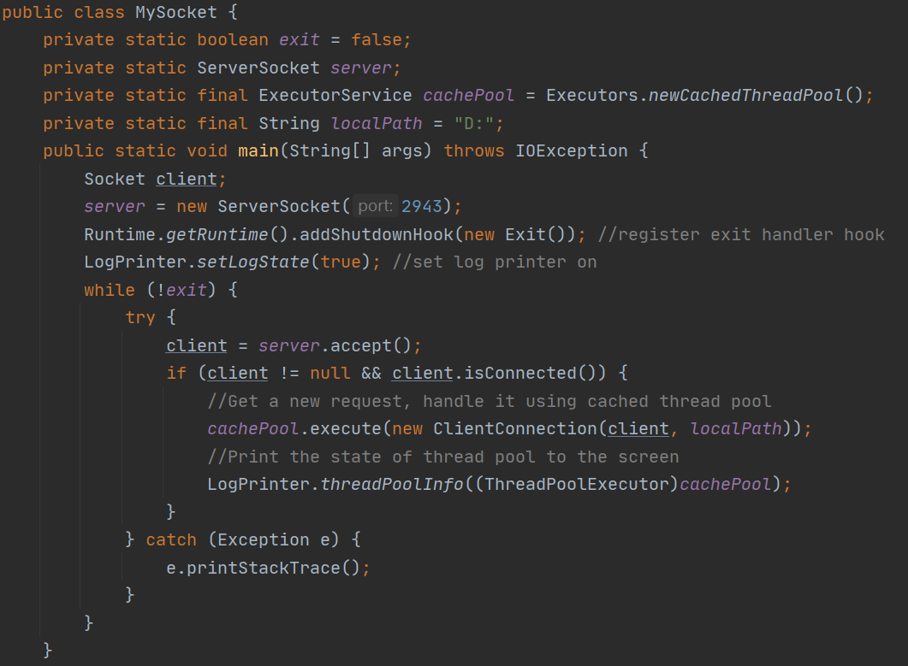

ClientConnection类继承自Thread类，根据传入的客户端socket和部署路径（即地址映射：默认D盘）进行初始化：保存设定的服务器根路径（即部署路径）、获得客户端的输入输出流，以处理请求和进行响应。


线程池执行这个线程时，run方法被调用。此方法首先根据socket输入流创建自定义的RequestParser实例，在此实例中根据请求头解析相关信息。忽略对ico文件的请求，而接受GET和POST请求。

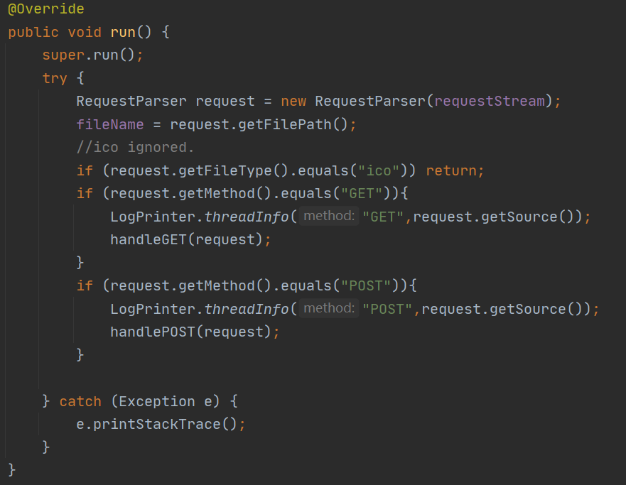

#### RequestParser

RequestParser在构造函数中提取第一行，获取方法名、请求的资源名、协议名，并保存到内部成员变量中。

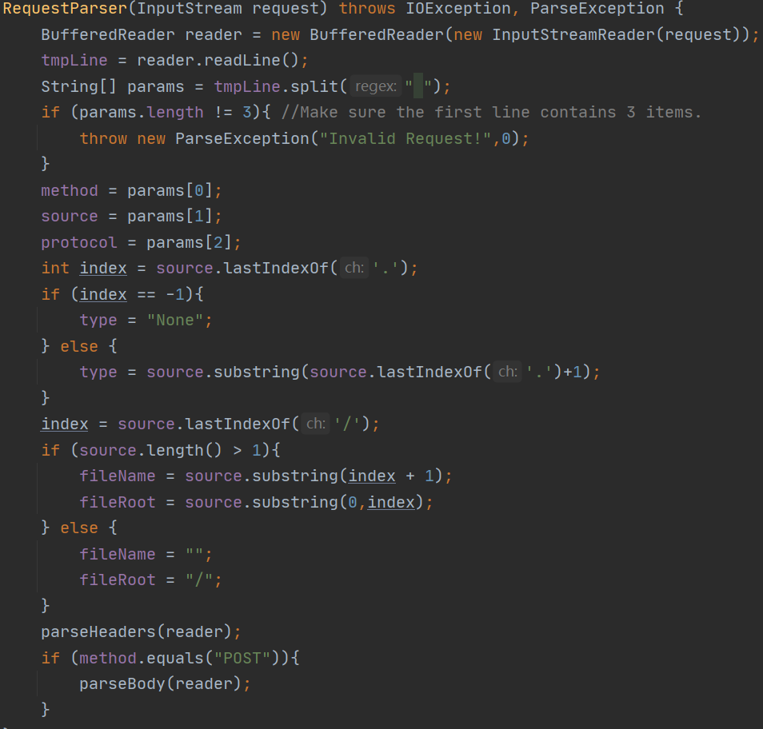

#### parseHeaders

parseHeaders函数用于将请求头的其余参数组成键值对的形式保存以供使用；parseBody则针对于post请求，将请求体中各个变量拆解成键值对保存下来。

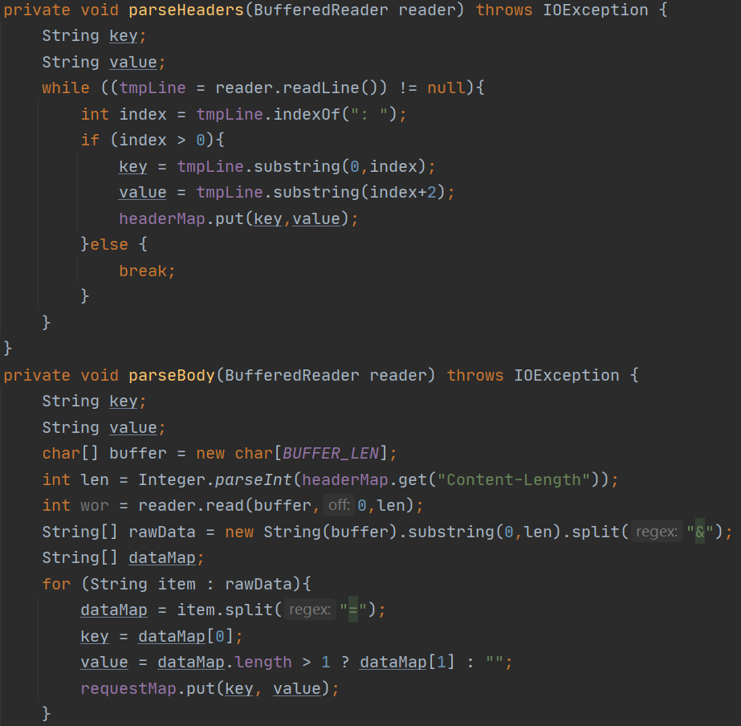

#### handleGET

handleGET用于处理响应GET请求。首先将文件名进行url解码，然后构建文件输入流，以读取文件信息。如果这个客户端请求的文件存在，则返回200响应码，否则返回404。响应分为两部分进行，首先设置响应头，然后设置响应体。在设置响应头时，首先判断这一文件的后缀名。如果是zup文件，则先将文件读出为字符串，然后使用循环语句将`<%%>`内的语句替换为执行后的结果，只到该文件不再含有能够配对的`<%%>`标记，随后根据剩余文本的长度设置响应头，其中响应码为200。

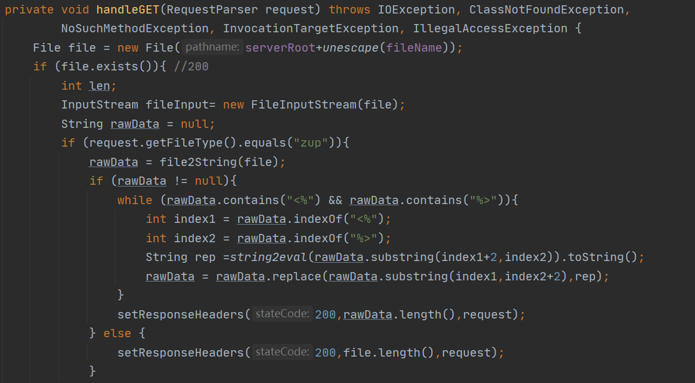

如果请求的文件是jzup文件，则首先判断请求的jzup文件的目录是否存在。当存在时，遍历判断该文件所在的目录下是否存在已经编译过的class文件。如果存在class文件则不作其他处理，等待下一步处理。如果不存在对应的class文件，则首先将jzup文件拷贝并重命名为java文件，然后编译这一java文件。

如果请求的文件既不是jzup文件也不是zup文件，则响应头设置为正常的200。（之前已经进行过文件的存在性判断）

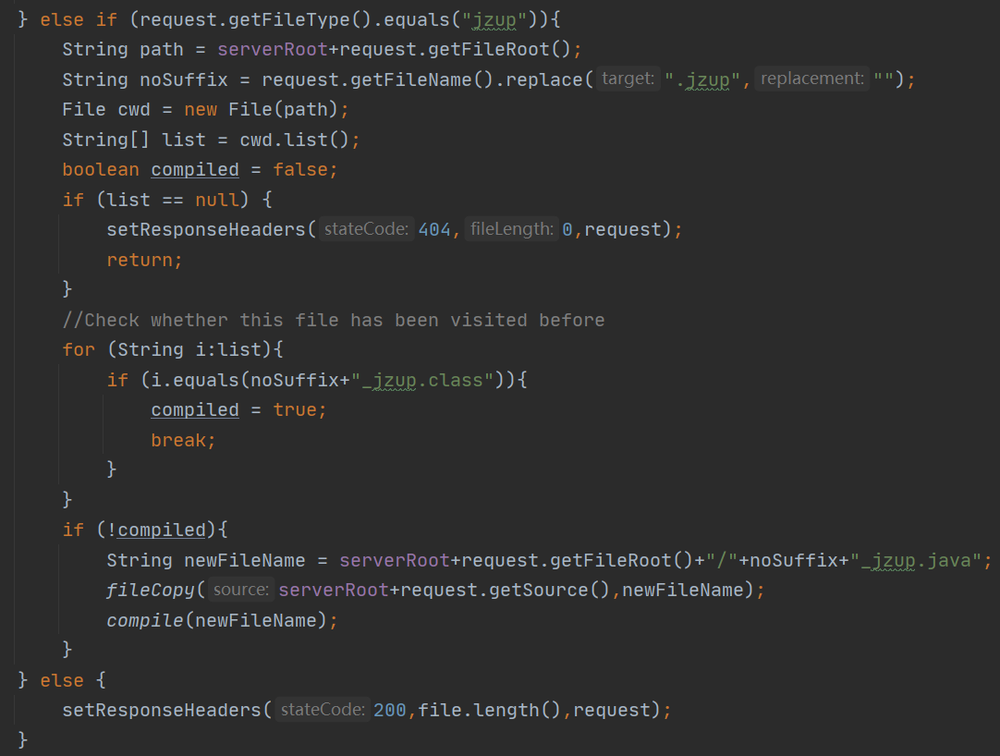

handleGET以上部分负责响应头的处理，以下部分负责响应体的处理。

处理zup文件时，直接写入之前处理后的字符串即可。

处理jzup文件时，首先通过构造MyClassLoader对象跨目录获取类。因为服务器端代码编译后的类的工作目录在`xxx\socket\out\production\socket`下，而客户端请求的文件编译出的class可能分布于各个地方，直接通过反射的方法并不能读取到响应的class。因此采用自定义classloader的方式重新定义类加载器以跨目录读取类文件。

处理其他文件时，使用缓冲字节数组循环读取只到文件结束。

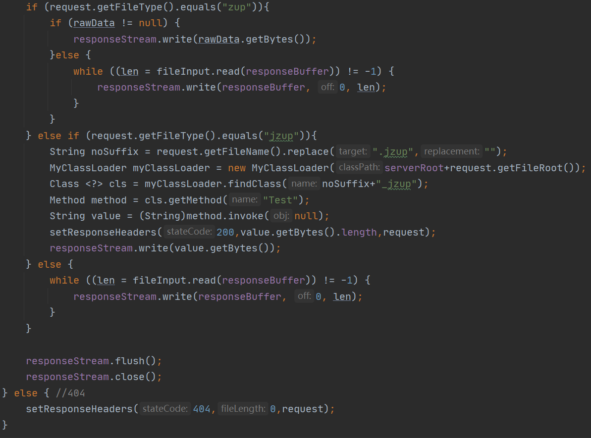

#### compile

编译java文件。编译正常结束后，删除java文件。则正常执行前后的中间java文件不会保留。如果编译出错则java文件保留。

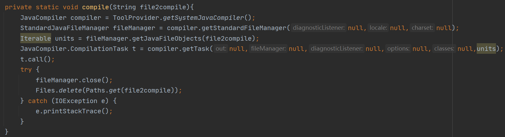

#### setResponseHeaders

这一函数用于设置响应头。在http协议中有两个响应参数是必须的：Content-Length与Content-Type。前者设定返回的字节数，后者设定返回的文件类型。

首先根据请求的文件类型设置Content-Type。对于txt、java、zup、jzup文件，此处采取text/plain处理，即在浏览器加载为纯文本格式。对于htm和html按html进行加载。三种图片格式均返回图片。其他文件类型返回二进制数据application/otcet-stream，在浏览器解析为文件下载。

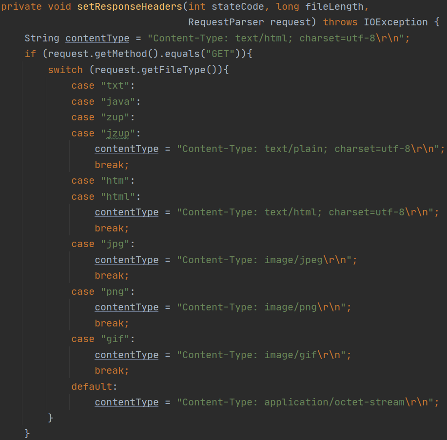

setResponseHeaders函数随后根据传入的文件长度动态设定Content-Length信息。接着连续的两个`\r\n`表示响应头传递结束，随后进行响应体的传输。这里仅返回200和404两种状态码。为方便起见，这里对于404响应也顺带返回了响应体。

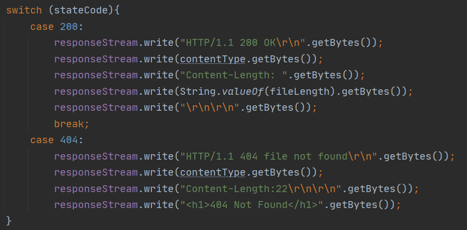

### 运行实例

==测试运行时需要将resources文件夹拷贝到D盘，并在IDEA中运行项目。然后直接访问提供的链接即可==

#### 原样传送txt、html、java文件

直接访问test.html，实现对html文本与图片数据的传递

http://127.0.0.1:2943/resources/html/test.html


直接访问java文件，传递文本格式

http://127.0.0.1:2943/resources/MySocket.java

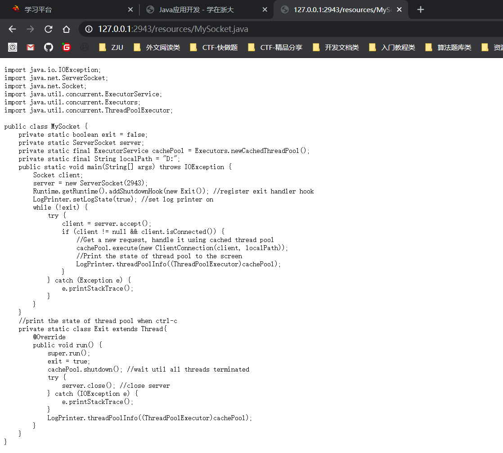

访问文本格式文件

http://127.0.0.1:2943/resources/txt/test.txt

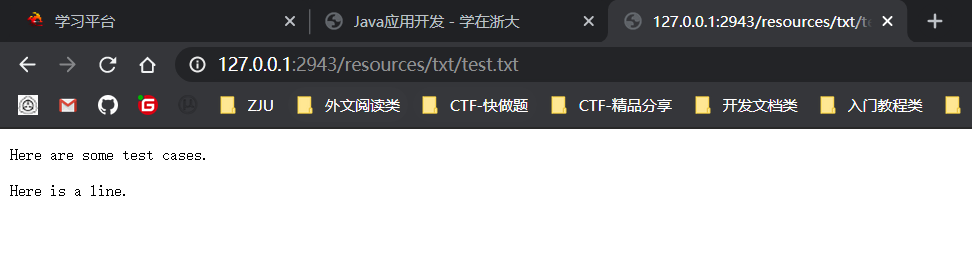

#### 以文本格式传送zup文件，但返回解析结果

本地test.zup文件内容如下

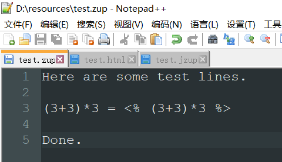

如下所示，解析成功

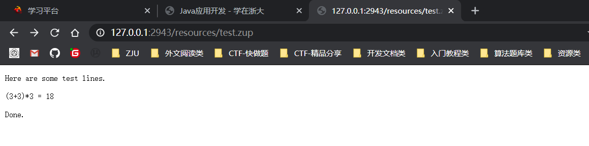

#### 编译jzup对应java文件并返回执行结果

这里使用的jzup是一个返回String的静态方法Test，不接收参数

http://127.0.0.1:2943/resources/test.jzup

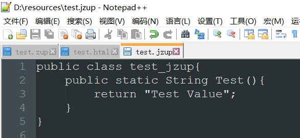

可见返回了执行结果

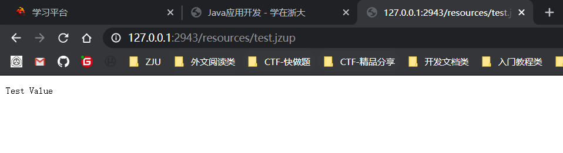

由于已存在之前访问的test_jzup.class文件，则不重新编译

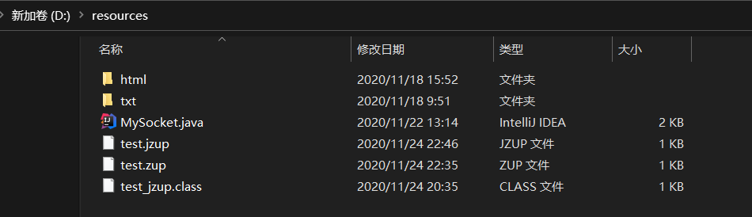

#### 其他扩展名返回二进制信息

如图，对于jpg文件，直接返回这个文件

http://127.0.0.1:2943/resources/html/img/logo.jpg

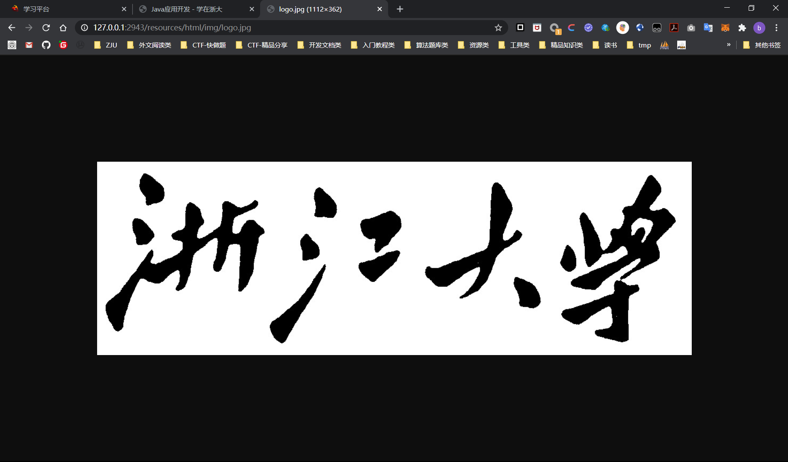

#### 对于不存在的文件返回404

如题，随意输入资源后返回404 Not Found

http://127.0.0.1:2943/resources/notexist.html

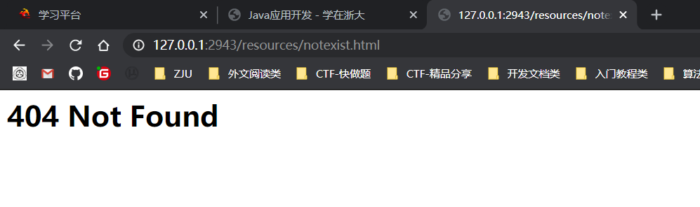

#### 表单处理

使用3180102943与2943作为用户名和密码进行登录，显示成功

http://127.0.0.1:2943/resources/html/noimg.html

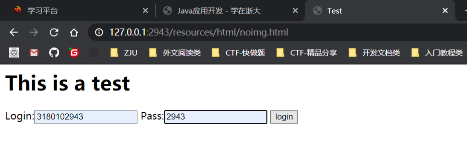


其他的输入均失败

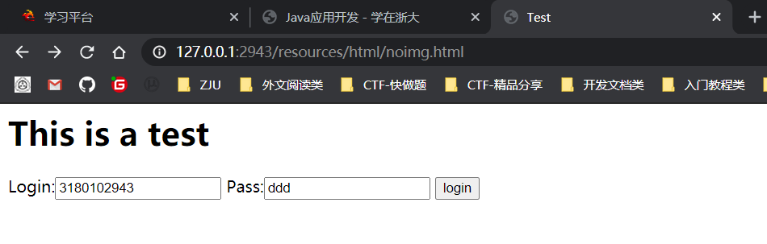

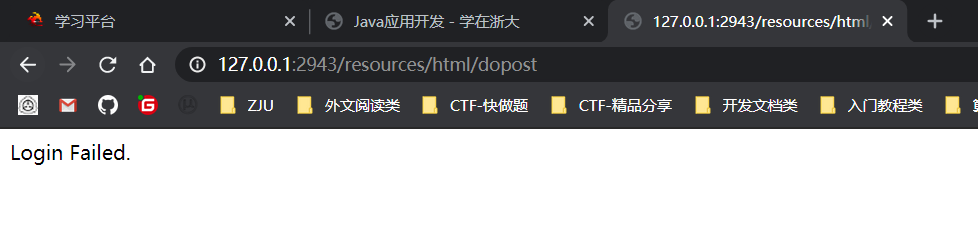

#### 文件下载

直接访问一个存在的文件、且后缀名不是上述各中后缀名时则下载文件

http://127.0.0.1:2943/resources/downloadTest

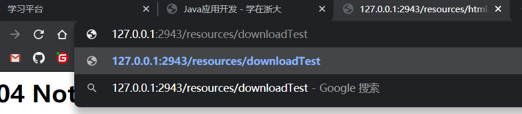

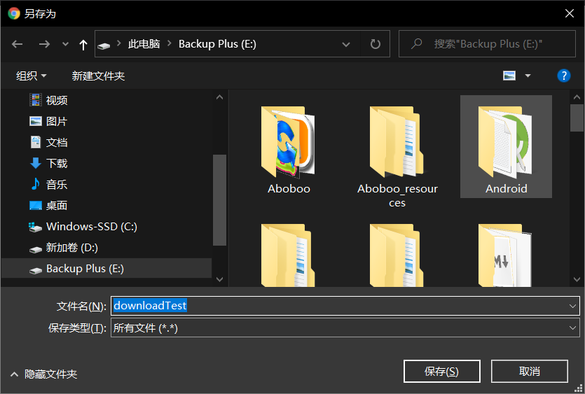

### 编译环境

* IDE

  ```
  IntelliJ IDEA 2020.2.3 (Ultimate Edition)
  Build #IU-202.7660.26, built on October 6, 2020
  Licensed to https://zhile.io
  You have a perpetual fallback license for this version
  Subscription is active until July 8, 2089
  Runtime version: 11.0.8+10-b944.34 amd64
  VM: OpenJDK 64-Bit Server VM by JetBrains s.r.o.
  Windows 10 10.0
  GC: ParNew, ConcurrentMarkSweep
  Memory: 1965M
  Cores: 8
  Registry: ide.suppress.double.click.handler=true
  Non-Bundled Plugins: Statistic, org.jetbrains.kotlin, com.intellij.plugins.html.instantEditing, com.jetbrains.php, Pythonid
  ```

* JAVA version 

  ```
  java version "1.8.0_271"
  Java(TM) SE Runtime Environment (build 1.8.0_271-b09)
  Java HotSpot(TM) 64-Bit Server VM (build 25.271-b09, mixed mode)
  ```

* OS

  ```
  Microsoft Window 10 家庭中文版
  基于x64的电脑
  ```

  

### 主要文件及目录说明

```python
./
|-resources/ #服务器资源目录，【需要拷贝到D:/下】
|          |-html/
|          |     |-img/
|          |     |    |-logo.jpg
|          |     |-noimg.html
|          |     |-test.html
|          |-txt/
|          |    |-test.txt
|          |-test.zup
|          |-test.jzup
|          |-downloadTest
|-socket/ #工程目录，此目录需直接在IDEA打开
|       |-.idea/*
|       |-out/
|       |    |-production/*
|       |    |-artifacts/
|       |               |-socket_jar/
|       |                           |-socket.jar #每次进行Build jar时，产生的jar将保存在此处
|       |-src/
|            |-META-INF/*
|            |-ClientConnection.java #程序源代码ClientConnection类，用于处理请求并进行响应
|            |-LogPrinter.java #程序源代码LogPrinter类，用于输出调试信息
|            |-MySocket.java #程序源代码Mysocket类 （main），用于建立socket
|            |-RequestParser.java #程序源代码RequestParser类，用于解析请求
|            |-MyClassLoader.java #程序源代码MyClassLoader类，用于加载指定路径的class
|            |-socket.iml
|-Java_Web服务器实验报告.md #本README文件(pdf若出现错位请阅读md)
|-Java_Web服务器实验报告.pdf #本README文件
```

### 运行说明

1. 首先需要将`resources`目录拷贝到D盘下（或者修改`Mysocket`类下的`localPath`为新的`resource`路径）
2. 使用`Intellij IDEA`直接打开`socket`目录，即为工程目录。使用快捷键`Shift+F10`直接运行项目。
3. 使用浏览器访问如下测试网址
   * http://127.0.0.1:2943/resources/txt/test.txt 
   * http://127.0.0.1:2943/resources/html/test.html
   * http://127.0.0.1:2943/resources/html/noimg.html
   * http://127.0.0.1:2943/resources/html/img/logo.jpg
   * http://127.0.0.1:2943/resources/MySocket.java
   * http://127.0.0.1:2943/resources/test.zup
   * http://127.0.0.1:2943/resources/test.jzup
   * http://127.0.0.1:2943/resources/downloadTest

### 实验心得

本次工程量很大，其中克服了许多问题。

首先是对http协议的学习，服务器必须传递合适的响应头才能被浏览器接受，否则就会出现Invalid Response的错误。通过学习了解到必须设定Content-Length和Content-Type两个响应头，才能被浏览器解析。在处理Content-Length的时候有一些问题：Content-Length是指响应体的字节数，但是对于zup和jzup文件必须进一步处理才能确定字节数，而这一步骤是在设定请求头之后才进行的。因此对正常文件与这两类特殊的文件有不同的请求头设置方式。

此外遇到的问题是处理post请求时不能和处理get请求那样使用readline循环等待，否则会陷入阻塞中导致程序卡死。为解决这一问题，我换用一种方法：读取请求头的Content-Length以获取请求体的长度，然后只读这一固定长度的字符。

在整个项目的编程中还遇到了零零散散的问题，比如如何执行字符串、如何用java程序执行class中的函数、如何跨目录使用java反射、如何将文件转成字符串，等等。大部分问题通过上网搜索资料都得到了学习、解决。

### 附录源码

#### MySocket.java

```java
import java.io.IOException;
import java.net.ServerSocket;
import java.net.Socket;
import java.util.concurrent.ExecutorService;
import java.util.concurrent.Executors;
import java.util.concurrent.ThreadPoolExecutor;

public class MySocket {
    private static boolean exit = false;
    private static ServerSocket server;
    private static final ExecutorService cachePool = Executors.newCachedThreadPool();
    private static final String localPath = "D:";
    public static void main(String[] args) throws IOException {
        Socket client;
        server = new ServerSocket(2943);
        Runtime.getRuntime().addShutdownHook(new Exit()); //register exit handler hook
        LogPrinter.setLogState(true); //set log printer on
        while (!exit) {
            try {
                client = server.accept();
                if (client != null && client.isConnected()) {
                    //Get a new request, handle it using cached thread pool
                    cachePool.execute(new ClientConnection(client, localPath));
                    //Print the state of thread pool to the screen
                    LogPrinter.threadPoolInfo((ThreadPoolExecutor)cachePool);
                }
            } catch (Exception e) {
                e.printStackTrace();
            }
        }
    }
    //print the state of thread pool when ctrl-c
    private static class Exit extends Thread{
        @Override
        public void run() {
            super.run();
            exit = true;
            cachePool.shutdown(); //wait util all threads terminated
            try {
                server.close(); //close server
            } catch (IOException e) {
                e.printStackTrace();
            }
            LogPrinter.threadPoolInfo((ThreadPoolExecutor)cachePool);
        }
    }
}
```

#### ClientConnection.java

```java
import javax.script.ScriptEngine;
import javax.script.ScriptEngineManager;
import javax.script.ScriptException;
import javax.tools.JavaCompiler;
import javax.tools.StandardJavaFileManager;
import javax.tools.ToolProvider;
import java.io.*;
import java.lang.reflect.InvocationTargetException;
import java.lang.reflect.Method;
import java.net.Socket;
import java.nio.file.Files;
import java.nio.file.Paths;
import java.util.Map;

public class ClientConnection extends Thread{
    private InputStream requestStream;
    private OutputStream responseStream;
    private final String serverRoot;
    private String fileName;
    private static final int MAX_BUFFER_LENGTH = 8192;
    private static final String account = "3180102943";
    private static final String password = "2943";
    private final byte[] responseBuffer = new byte[MAX_BUFFER_LENGTH];
    ClientConnection(Socket client, String deployPath) {
        serverRoot = deployPath; //address convert
        try{
            requestStream = client.getInputStream();
            responseStream = client.getOutputStream();
        } catch (Exception e){
            e.printStackTrace();
        }
    }

    @Override
    public void run() {
        super.run();
        try {
            RequestParser request = new RequestParser(requestStream);
            fileName = request.getFilePath();
            //ico ignored.
            if (request.getFileType().equals("ico")) return;
            if (request.getMethod().equals("GET")){
                LogPrinter.threadInfo("GET",request.getSource());
                handleGET(request);
            }
            if (request.getMethod().equals("POST")){
                LogPrinter.threadInfo("POST",request.getSource());
                handlePOST(request);
            }

        } catch (Exception e) {
            e.printStackTrace();
        }
    }

    private void handlePOST(RequestParser request) throws IOException {
        String src = request.getSource();
        src = src.substring(src.lastIndexOf('/')+1);
        if (src.equals("dopost")){ //200
            Map<String, String> reqMap = request.getRequestMap();
            String login = reqMap.get("login");
            String pass = reqMap.get("pass");
            String msg;
            if (login.equals(account) && pass.equals(password)){
                msg = "Login Success!";
            } else {
                msg = "Login Failed.";
            }
            msg = "<html><body>" + msg + "</body></html>";
            setResponseHeaders(200,msg.getBytes().length,request);
            responseStream.write(msg.getBytes());
            responseStream.flush();
            responseStream.close();
        } else { //404
            setResponseHeaders(404,0,request);
        }
    }

    private void handleGET(RequestParser request) throws IOException, ClassNotFoundException,
            NoSuchMethodException, InvocationTargetException, IllegalAccessException {
        File file = new File(serverRoot+unescape(fileName));
        if (file.exists()){ //200
            int len;
            InputStream fileInput= new FileInputStream(file);
            String rawData = null;
            if (request.getFileType().equals("zup")){
                rawData = file2String(file);
                if (rawData != null){
                    while (rawData.contains("<%") && rawData.contains("%>")){
                        int index1 = rawData.indexOf("<%");
                        int index2 = rawData.indexOf("%>");
                        String rep =string2eval(rawData.substring(index1+2,index2)).toString();
                        rawData = rawData.replace(rawData.substring(index1,index2+2),rep);
                    }
                    setResponseHeaders(200,rawData.length(),request);
                } else {
                    setResponseHeaders(200,file.length(),request);
                }
            } else if (request.getFileType().equals("jzup")){
                String path = serverRoot+request.getFileRoot();
                String noSuffix = request.getFileName().replace(".jzup","");
                File cwd = new File(path);
                String[] list = cwd.list();
                boolean compiled = false;
                if (list == null) {
                    setResponseHeaders(404,0,request);
                    return;
                }
                //Check whether this file has been visited before
                for (String i:list){
                    if (i.equals(noSuffix+"_jzup.class")){
                        compiled = true;
                        break;
                    }
                }
                if (!compiled){
                    String newFileName = serverRoot+request.getFileRoot()+"/"+noSuffix+"_jzup.java";
                    fileCopy(serverRoot+request.getSource(),newFileName);
                    compile(newFileName);
                }
            } else {
                setResponseHeaders(200,file.length(),request);
            }

            if (request.getFileType().equals("zup")){
                if (rawData != null) {
                    responseStream.write(rawData.getBytes());
                }else {
                    while ((len = fileInput.read(responseBuffer)) != -1) {
                        responseStream.write(responseBuffer, 0, len);
                    }
                }
            } else if (request.getFileType().equals("jzup")){
                String noSuffix = request.getFileName().replace(".jzup","");
                MyClassLoader myClassLoader = new MyClassLoader(serverRoot+request.getFileRoot());
                Class <?> cls = myClassLoader.findClass(noSuffix+"_jzup");
                Method method = cls.getMethod("Test");
                String value = (String)method.invoke(null);
                setResponseHeaders(200,value.getBytes().length,request);
                responseStream.write(value.getBytes());
            } else {
                while ((len = fileInput.read(responseBuffer)) != -1) {
                    responseStream.write(responseBuffer, 0, len);
                }
            }

            responseStream.flush();
            responseStream.close();
        } else { //404
            setResponseHeaders(404,0,request);
        }
    }

    private void setResponseHeaders(int stateCode, long fileLength,
                                    RequestParser request) throws IOException {
        String contentType = "Content-Type: text/html; charset=utf-8\r\n";
        if (request.getMethod().equals("GET")){
            switch (request.getFileType()){
                case "txt":
                case "java":
                case "zup":
                case "jzup":
                    contentType = "Content-Type: text/plain; charset=utf-8\r\n";
                    break;
                case "htm":
                case "html":
                    contentType = "Content-Type: text/html; charset=utf-8\r\n";
                    break;
                case "jpg":
                    contentType = "Content-Type: image/jpeg\r\n";
                    break;
                case "png":
                    contentType = "Content-Type: image/png\r\n";
                    break;
                case "gif":
                    contentType = "Content-Type: image/gif\r\n";
                    break;
                default:
                    contentType = "Content-Type: application/octet-stream\r\n";
            }
        }

        switch (stateCode){
            case 200:
                responseStream.write("HTTP/1.1 200 OK\r\n".getBytes());
                responseStream.write(contentType.getBytes());
                responseStream.write("Content-Length: ".getBytes());
                responseStream.write(String.valueOf(fileLength).getBytes());
                responseStream.write("\r\n\r\n".getBytes());
                break;
            case 404:
                responseStream.write("HTTP/1.1 404 file not found\r\n".getBytes());
                responseStream.write("Content-Type: text/html; charset=utf-8\r\n".getBytes());
                responseStream.write("Content-Length:22\r\n\r\n".getBytes());
                responseStream.write("<h1>404 Not Found</h1>".getBytes());
        }
    }

    private static String unescape(String s) {
        StringBuilder sbuf = new StringBuilder();
        int l = s.length();
        int ch = -1;
        int b, sumb = 0;
        for (int i = 0, more = -1; i < l; i++) {
            /* Get next byte b from URL segment s */
            switch (ch = s.charAt(i)) {
                case '%':
                    ch = s.charAt(++i);
                    int hb = (Character.isDigit((char) ch) ? ch - '0'
                            : 10 + Character.toLowerCase((char) ch) - 'a') & 0xF;
                    ch = s.charAt(++i);
                    int lb = (Character.isDigit((char) ch) ? ch - '0'
                            : 10 + Character.toLowerCase((char) ch) - 'a') & 0xF;
                    b = (hb << 4) | lb;
                    break;
                case '+':
                    b = ' ';
                    break;
                default:
                    b = ch;
            }
            /* Decode byte b as UTF-8, sumb collects incomplete chars */
            if ((b & 0xc0) == 0x80) { // 10xxxxxx (continuation byte)
                sumb = (sumb << 6) | (b & 0x3f); // Add 6 bits to sumb
                if (--more == 0)
                    sbuf.append((char) sumb); // Add char to sbuf
            } else if ((b & 0x80) == 0x00) { // 0xxxxxxx (yields 7 bits)
                sbuf.append((char) b); // Store in sbuf
            } else if ((b & 0xe0) == 0xc0) { // 110xxxxx (yields 5 bits)
                sumb = b & 0x1f;
                more = 1; // Expect 1 more byte
            } else if ((b & 0xf0) == 0xe0) { // 1110xxxx (yields 4 bits)
                sumb = b & 0x0f;
                more = 2; // Expect 2 more bytes
            } else if ((b & 0xf8) == 0xf0) { // 11110xxx (yields 3 bits)
                sumb = b & 0x07;
                more = 3; // Expect 3 more bytes
            } else if ((b & 0xfc) == 0xf8) { // 111110xx (yields 2 bits)
                sumb = b & 0x03;
                more = 4; // Expect 4 more bytes
            } else /*if ((b & 0xfe) == 0xfc)*/{ // 1111110x (yields 1 bit)
                sumb = b & 0x01;
                more = 5; // Expect 5 more bytes
            }
            /* We don't test if the UTF-8 encoding is well-formed */
        }
        return sbuf.toString();
    }
    private String file2String(File file) {
        InputStreamReader reader = null;
        StringWriter writer = new StringWriter();
        try {
            reader = new InputStreamReader(new FileInputStream(file));
            char[] buffer = new char[MAX_BUFFER_LENGTH];
            int n;
            while (-1 != (n = reader.read(buffer))) {
                writer.write(buffer, 0, n);
            }
        } catch (Exception e) {
            e.printStackTrace();
            return null;
        } finally {
            if (reader != null)
                try {
                    reader.close();
                } catch (IOException e) {
                    e.printStackTrace();
                }
        }
        return writer.toString();
    }
    private static boolean string2File(String res, String filePath) {
        boolean flag = true;
        BufferedReader bufferedReader = null;
        BufferedWriter bufferedWriter = null;
        try {
            File distFile = new File(filePath);
            if (!distFile.getParentFile().exists()) distFile.getParentFile().mkdirs();
            bufferedReader = new BufferedReader(new StringReader(res));
            bufferedWriter = new BufferedWriter(new FileWriter(distFile));
            char[] buf = new char[MAX_BUFFER_LENGTH];
            int len;
            while ((len = bufferedReader.read(buf)) != -1) {
                bufferedWriter.write(buf, 0, len);
            }
            bufferedWriter.flush();
            bufferedReader.close();
            bufferedWriter.close();
        } catch (IOException e) {
            e.printStackTrace();
            flag = false;
            return flag;
        } finally {
            if (bufferedReader != null) {
                try {
                    bufferedReader.close();
                } catch (IOException e) {
                    e.printStackTrace();
                }
            }
        }
        return flag;
    }

    private static Object string2eval(String exec) {
        ScriptEngineManager manager = new ScriptEngineManager();
        ScriptEngine engine = manager.getEngineByName("js");
        Object result = null;
        try {
            result = engine.eval(exec);
        } catch (ScriptException e) {
            e.printStackTrace();
        }
        return result;
    }

    private static void compile(String file2compile){
        JavaCompiler compiler = ToolProvider.getSystemJavaCompiler();
        StandardJavaFileManager fileManager = compiler.getStandardFileManager(null,null,null);
        Iterable units = fileManager.getJavaFileObjects(file2compile);
        JavaCompiler.CompilationTask t = compiler.getTask(null,null,null,null,null,units);
        t.call();
        try {
            fileManager.close();
            Files.delete(Paths.get(file2compile));
        } catch (IOException e) {
            e.printStackTrace();
        }
    }

    public static void fileCopy(String source, String dest) {
        InputStream in;
        OutputStream out;
        try {
            in = new FileInputStream(new File(source));
            out = new FileOutputStream(new File(dest));
            byte[] buffer = new byte[MAX_BUFFER_LENGTH];
            int len;
            while ((len = in.read(buffer)) > 0) {
                out.write(buffer, 0, len);
            }
            in.close();
            out.close();
        } catch (Exception e) {
           e.printStackTrace();
        }
    }
}

```

#### MyClassLoader.java

```java
import java.io.*;
import java.nio.ByteBuffer;
import java.nio.channels.Channels;
import java.nio.channels.FileChannel;
import java.nio.channels.WritableByteChannel;

public class MyClassLoader extends ClassLoader {
    private final String classPath;
    private static final int MAX_BUFFER_LENGTH = 8192;
    public MyClassLoader(String classPath) {
        this.classPath = classPath;
    }

    @Override
    protected Class<?> findClass(String name) throws ClassNotFoundException {
        byte[] bytes;
        Class<?> clazz;
        try {
            bytes = getClassByte(name);
            clazz = defineClass(name,bytes,0,bytes.length);
            return clazz;
        } catch (IOException e) {
            e.printStackTrace();
        }
        return super.findClass(name);
    }

    private byte[] getClassByte(String name) throws IOException {
        String classFile = classPath + "/" + name.replace(".", File.separator)+".class";
        File file = new File(classFile);
        FileInputStream fileInputStream = new FileInputStream(file);
        FileChannel fileChannel = fileInputStream.getChannel();
        ByteArrayOutputStream byteArrayOutputStream = new ByteArrayOutputStream();
        WritableByteChannel writableByteChannel = Channels.newChannel(byteArrayOutputStream);
        ByteBuffer byteBuffer = ByteBuffer.allocate(MAX_BUFFER_LENGTH);
        int i;
        while (true) {
            i = fileChannel.read(byteBuffer);
            if (i == 0 || i == -1) {
                break;
            }
            byteBuffer.flip();
            writableByteChannel.write(byteBuffer);
            byteBuffer.clear();
        }
        writableByteChannel.close();
        fileChannel.close();
        fileInputStream.close();
        return byteArrayOutputStream.toByteArray();
    }
}
```

#### LogPrinter.java

```java
import java.util.concurrent.ThreadPoolExecutor;

public class LogPrinter {
    private static boolean logState = false;
    public static void threadInfo(String method, String file){
        if (logState){
            String name = Thread.currentThread().getName();
            System.out.println("[" + method + " : " + file + "] : " + name + " is running now");
        }
    }
    public static void threadPoolInfo(ThreadPoolExecutor pool){
        if (logState){
            if (pool.isShutdown()){
                System.out.println("Thread pool is shut down");
            } else if (pool.isTerminating()) {
                System.out.println("Thread pool is terminating");
            } else if (pool.isTerminated()) {
                System.out.println("Thread pool is terminated");
            } else {
                System.out.println("Thread pool is active");
            }
            System.out.println("There are " + pool.getActiveCount() + " active threads in the pool");
        }
    }
    public static boolean getLogState(){
        return logState;
    }
    public static void setLogState(boolean state){
        logState = state;
    }
}

```

#### RequestParser.java

```java
import java.io.BufferedReader;
import java.io.IOException;
import java.io.InputStream;
import java.io.InputStreamReader;
import java.text.ParseException;
import java.util.HashMap;
import java.util.Map;

/*
This class is will parse the input stream of the request,
split and store its attributes in the class itself.

This class also contains some methods to provide the extracted information.
 */
public class RequestParser {
    private final String method;
    private final String source;
    private final String fileName;
    private final String protocol;
    private final String type;
    private final String fileRoot;
    private final Map<String,String> headerMap = new HashMap<String, String>();
    private final Map<String,String> requestMap = new HashMap<String, String>();
    private String tmpLine;
    private static final int BUFFER_LEN = 8192;
    RequestParser(InputStream request) throws IOException, ParseException {
        BufferedReader reader = new BufferedReader(new InputStreamReader(request));
        tmpLine = reader.readLine();
        String[] params = tmpLine.split(" ");
        if (params.length != 3){ //Make sure the first line contains 3 items.
            throw new ParseException("Invalid Request!",0);
        }
        method = params[0];
        source = params[1];
        protocol = params[2];
        int index = source.lastIndexOf('.');
        if (index == -1){
            type = "None";
        } else {
            type = source.substring(source.lastIndexOf('.')+1);
        }
        index = source.lastIndexOf('/');
        if (source.length() > 1){
            fileName = source.substring(index + 1);
            fileRoot = source.substring(0,index);
        } else {
            fileName = "";
            fileRoot = "/";
        }
        parseHeaders(reader);
        if (method.equals("POST")){
            parseBody(reader);
        }
    }


    public String getMethod(){
        return method;
    }

    public String getSource(){ return source; }

    public String getFileName(){ return fileName; }

    public String getFileType(){
        return type.toLowerCase();
    }

    public String getFileRoot() {
        return fileRoot;
    }

    public String getFilePath(){
        int index = source.indexOf("/");
        if (index == -1){
            return source;
        } else {
            return source.substring(index);
        }
    }

    public String getProtocol(){
        return protocol;
    }

    public Map<String,String> getHeaderMap(){
        return headerMap;
    }

    public Map<String,String> getRequestMap(){
        return requestMap;
    }

    private void parseHeaders(BufferedReader reader) throws IOException {
        String key;
        String value;
        while ((tmpLine = reader.readLine()) != null){
            int index = tmpLine.indexOf(": ");
            if (index > 0){
                key = tmpLine.substring(0,index);
                value = tmpLine.substring(index+2);
                headerMap.put(key,value);
            }else {
                break;
            }
        }
    }
    private void parseBody(BufferedReader reader) throws IOException {
        String key;
        String value;
        char[] buffer = new char[BUFFER_LEN];
        int len = Integer.parseInt(headerMap.get("Content-Length"));
        int wor = reader.read(buffer,0,len);
        String[] rawData = new String(buffer).substring(0,len).split("&");
        String[] dataMap;
        for (String item : rawData){
            dataMap = item.split("=");
            key = dataMap[0];
            value = dataMap.length > 1 ? dataMap[1] : "";
            requestMap.put(key, value);
        }
    }
}

```

